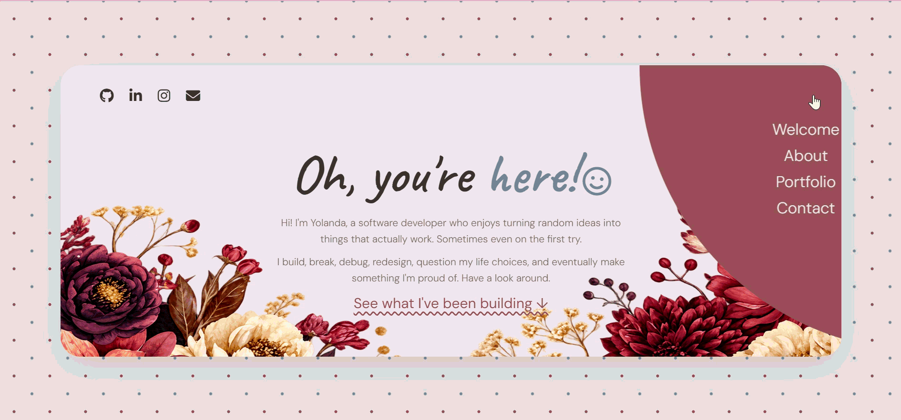

# yolanda.dev ♡

My personal developer portfolio — a little corner of the internet where I showcase the things I've built, the technologies I work with, and a bit about the person behind the code.



## About the Portfolio

This portfolio was designed and built from scratch to feel a little more personal than the usual developer portfolio.

It combines a scrapbook-inspired design with a clean interface and includes dedicated project previews where visitors can explore some of my work without leaving the portfolio.

## Featured Projects

### Unsaid
An AI-powered conversational support space where users can talk, vent and reflect in private conversations.

### NestaShots Photography
A photography portfolio and photoshoot booking website.

### Link Card
A personal link hub that brings my favourite platforms and online presence into one place.

### Block Jewel
A colourful browser-based block puzzle game where players clear rows, build combos and chase their high score.

### EasyBooking
An event booking platform where users can discover and book events while organisers create and manage their listings.

## Built With

- HTML5
- CSS3
- JavaScript
- Font Awesome
- Google Fonts

## Features

- Responsive design
- Custom scrapbook-inspired UI
- Light, animated navigation
- Horizontal project carousel
- Interactive project preview modals
- Dedicated project showcase pages
- Social and contact links
- Contact form interface

## Project Structure

```text
yolanda.dev/
│
├── index.html
├── style.css
│
├── assets/
│   ├── portfolio-1.png
│   ├── portfolio-2.png
│   ├── portfolio-3.png
│   ├── portfolio-4.png
│   └── portfolio-5.png
│
└── preview/
    ├── preview.css
    ├── preview-1.html
    ├── preview-2.html
    ├── preview-3.html
    ├── preview-4.html
    ├── preview-5.html
    │
    └── preview_assets/
```

## About Me

I'm **Yolanda Mbande**, a software developer based in Cape Town, South Africa.

I enjoy turning random ideas into things that actually work — usually after building, breaking, debugging and redesigning them a few times.

My main stack includes **PHP, Laravel, JavaScript, HTML and CSS**, and I'm always interested in learning something new.

## Connect With Me

- [GitHub](https://github.com/YolandaMbande)
- [LinkedIn](https://www.linkedin.com/in/yolanda-mbande/)
- [Instagram](https://www.instagram.com/mbande_yolanda/)
- Email: `y_mbande@icloud.com`

---

<p align="center">
  Designed & built by Yolanda Mbande ♡
</p>